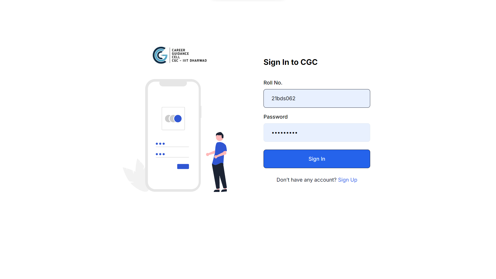
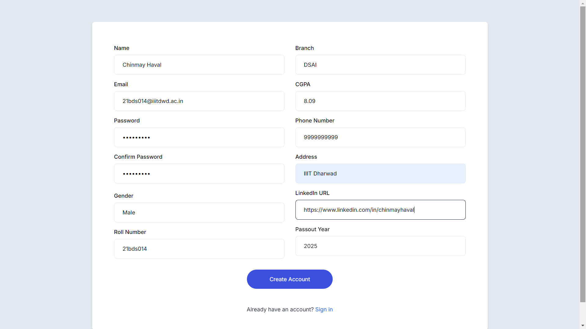
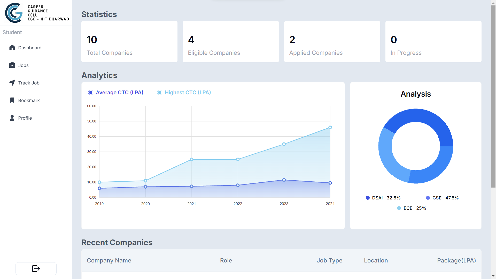
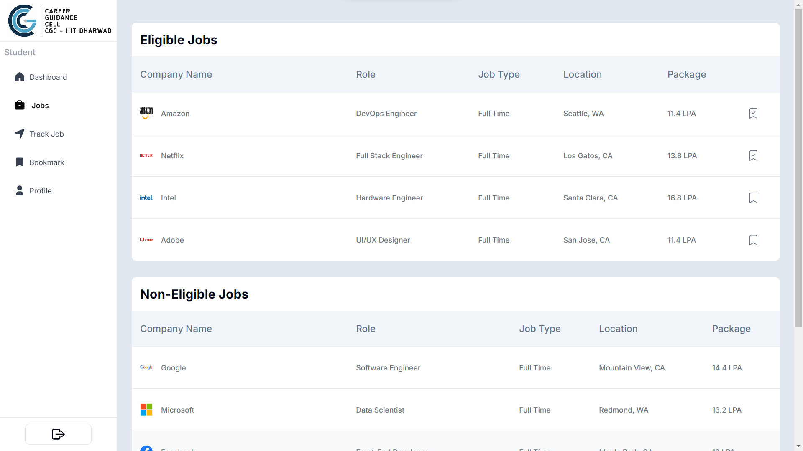
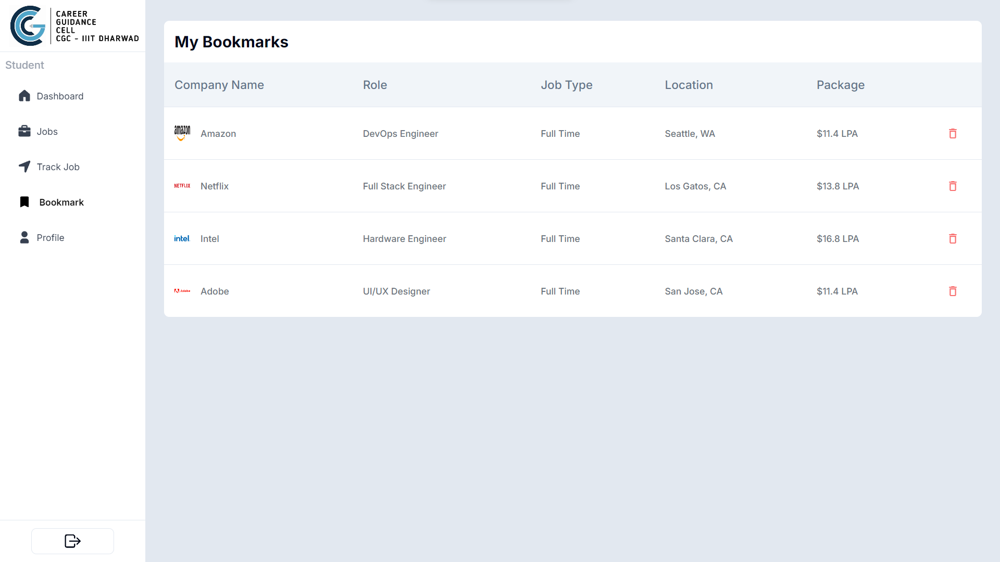

# Career Guidance Cell - College Placement App

### Hosted Link: [View Website](https://cgcstudents.vercel.app/signin)

A comprehensive web application designed to assist students in staying updated on college placement activities, offering real-time information on company visits, and facilitating the placement process with advanced analytics.

## Screenshots

### Sign In


### Sign Up


### Dashboard



### Jobs


### Applied Job Page


### Track Jobs


### Bookmark


### Deadline Passed


### Profile Section


### Edit Profile Details


## Features

- **Real-Time Updates**: The app provides instant notifications on company recruitment visits, allowing students to stay informed about the latest placement opportunities.
  
- **Student Dashboard**: A feature-rich dashboard offering real-time statistical analysis of 100% of placement data, including the total number of companies that visited and the most recent company visits.
  
- **Dynamic Filtering System**: A built-in system that dynamically evaluates student eligibility for specific companies based on GPA and graduation year, making the placement process more efficient for students and admins.

- **Secure Authentication**: Implemented secure user authentication using JWT (JSON Web Tokens) and bcrypt for password hashing, ensuring data protection and secure session management.

- **Responsive UI**: Designed a fully responsive user interface using Tailwind CSS, delivering a seamless experience across different devices for both students and administrators.

## Tech Stack

- **Frontend**: Next.js, TypeScript, JavaScript, Tailwind CSS
- **Backend**: Node.js, Express.js, MongoDB
- **Authentication**: JWT (JSON Web Tokens), bcrypt
- **Database**: MongoDB
- **Deployment**: Vercel (for frontend) and Render (for backend)

## Installation and Setup

1. Clone the repository:
    ```bash
    git clone https://github.com/yourusername/college-placement-app.git
    cd college-placement-app
    ```

2. Install dependencies:
    ```bash
    npm install
    ```

3. Set up environment variables:
    - Create a `.env` file in the root directory.
    - Add the following environment variables:
      ```bash
      MONGO_URI=your_mongodb_connection_string
      JWT_SECRET=your_jwt_secret
      ```

4. Start the application:
    ```bash
    npm run dev
    ```

5. Visit the application in your browser at `http://localhost:3000`.

## Contributions

Feel free to fork this repository and make contributions. Submit a pull request for any features or bug fixes.

## License

This project is licensed under the MIT License.
